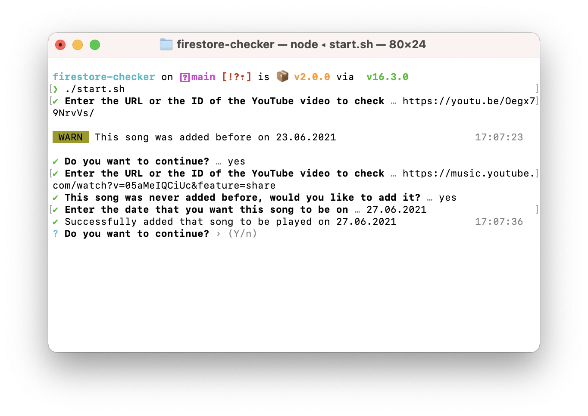

# Firestore Checker

🔬 The tool I use to add songs to [my Daily Song page](https://eggsy.xyz/daily) on my website. It's an essential tool to me and helps me to fetch different data from different APIs easily and automatically.

### Example

### What it does?

- Reads YouTube video ID from URL.
- Fetches YouTube metadata such as title, artist and thumbnail.
- Fetches lyrics and Spotify song URL from KSoft API.

### Why?

I like to share the music I listen and like. I've been doing this ever since I added a feature called "daily" to my old Discord bot. All songs were stored on a MongoDB collection along with bot's other collections and every new day, bot would send a different like according to the date.

This way I can share my music with my friends, and after I shut my bot down, I still wanted to share my music, so I created my first blog page using Express, Vue and Nuxt. After the huge refactor to Tailwind CSS and the current version of the website. I now have a Daily page where I show the songs of last 10 days along with the today's song. This tool helps me to fetch all required data from APIs and add a record to Firestore collection.

### Who needs this?

Probably no one.

### Furthermore

Sorry, I won't be putting any build or start steps because if you really want to use this, you'd have to figure your way out. You'll need a Firebase account, a Firestore database, a user to be able to authenticate and add songs, rules to make sure of the security, only allow your user to add/delete/edit documents.

If you don't have a website, or you have a backend tool (like if you have a Discord bot) you can edit the source file and delete the lines where it authenticates as a user. You can do this if it's safe to allow every user who can get your Firestore app information. It's usually safe for things like Discord bots since people won't be able to see those details, but if you own a website, people might find and control your database. Please be careful.
